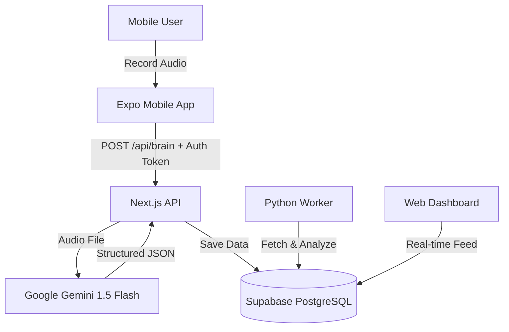

# Dyl: AI-Native Second Brain

> An end-to-end audio capture system that transforms raw voice notes into structured, actionable data using Gemini Flash, Next.js, and Supabase.


## 📖 Overview

Dyl is not just a voice recorder, it is a **structured intelligence pipeline**. It bridge the gap between mobile data capture and server-side AI processing.

Users record raw audio via the mobile app (Expo), which is stream to a Next.js Edge API. The system uses Google's Gemin Multimodal LLM to listen to the audio and extract structured JSON data (Summary, Sentiment, Action Items, Tags) before saving it to a Vector Database (Supabase) for future retrieval.

## 🏗️ Architecture

The system follows a **Microservices-adjacent Monorepo** architecture:


## ⚡ Tech Stack
**Frontend (Solito Monorepo)**
- Web: Next.js (App Router, Server Components)
- Mobile: Expo (React Native)
- Shared UI: NativeWind (TailwindCSS)
- State/Fetch: React Server Components (RSC) + Supabase Client

**Backend & AI**
- Database: Supabase (PostgreSQL + pgvector for Embeddings)
- Auth: Supabase Auth (JWT with RLS Policies)
- AI Engine: Vercel AI SDK + Google Gemini Flash
- Analytics Worker: Python + Pandas (Containerized via Docker)

## 🚀 Features
- **Multimodal Ingestion:** Direct audio processing without intermediate transcription processing.
- **Hybrid Authentication:** Secure session handling for both Web (Cookies) and Mobile (Bearer Tokens).
- **Structured Output:** Automatically categorizes chaotic voice notes into Summaries, Tasks, and Sentiments.
- **Dockerized Analytics:** Python microservice runs in an isolated container to perform heavy background analysis.
- **Row Level Security (RLS):** Database policies ensure users can only access their own memory bank.

## 🛠️ Getting Started
**Prerequisites**
- Node.js 18+
- Docker Desktop
- Supabase Account
- Google AI Studio Key

**1. Installation**
```sh
git clone https://github.com/your-username/dyl-speech-ai.git
cd dyl-speech-ai
npm install
```

**2. Environment Setup**
Create `.env` files for both apps:
`apps/next/.env.local`
```ssh
NEXT_PUBLIC_SUPABASE_URL=your_supabase_url
NEXT_PUBLIC_SUPABASE_ANON_KEY=your_anon_key
GOOGLE_GENERATIVE_AI_API_KEY=your_gemini_key
```
`apps/expo/.env`
```ssh
EXPO_PUBLIC_SUPABASE_URL=your_supabase_url
EXPO_PUBLIC_SUPABASE_ANON_KEY=your_anon_key
```
`apps/python-worker/.env`
```ssh
SUPABASE_URL=your_supabase_url
SUPABASE_SERVICE_KEY=your_service_role_key
```

**3. Running the system**
**Start the Full Stack:**
```ssh
# Terminal 1: Next.js
cd apps/next
yarn next

# Terminal 2: Expo
cd apps/expo
yarn start

# Terminal 3: Direct Python (Recommended)
cd apps/python-worker
pip install -r requirements.txt
python main.py
```

## 🔮 Roadmap
- [x] Phase 1: Infrastructure & Auth (Supabase/Solito)
- [x] Phase 2: Mobile Audio Capture (Expo-AV)
- [x] Phase 3: The "Brain" API (Gemini Integration)
- [x] Phase 4: Analytics Microservice (Python + Docker)
- [ ] Phase 5: RAG & Vector Search (Chat with your notes)
- [ ] Phase 6: Automated Weekly Email Reports

## 🤝 Contributing
1. Fork the Project
2. Create your Feature Branch (git checkout -b feat/AmazingFeature)
3. Commit your Changes (git commit -m 'feat: Add some AmazingFeature')
4. Push to the Branch (git push origin feat/AmazingFeature)
5. Open a Pull Request
